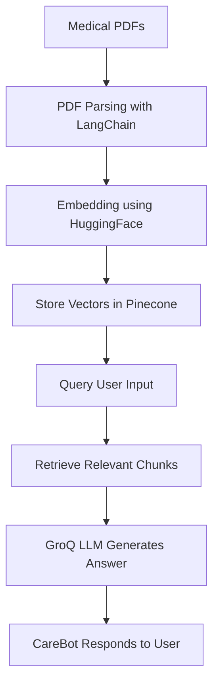

# 🧠 CareBot – AI-Powered Medical Chatbot using LLMs & Pinecone

CareBot is an **AI-driven medical chatbot** that answers healthcare-related queries based on **uploaded medical PDFs**.
It uses a **Retrieval-Augmented Generation (RAG)** pipeline powered by **LangChain**, **GroQ LLM**, **HuggingFace embeddings**, and **Pinecone** to provide **accurate, context-aware, and reliable** responses.

---

## 🚀 Features

* 💬 **LLM-Powered Chatbot** → Get intelligent, context-driven answers to medical queries.
* 📄 **Medical PDF Ingestion** → Upload prescriptions, medical guidelines, or reports for instant reference.
* 🧠 **RAG Pipeline** → Combines **document retrieval** with **GroQ LLM** for accurate responses.
* 🔍 **Semantic Search** → Uses **HuggingFace embeddings** for vector-based document search.
* 🗂️ **Pinecone Integration** → Fast and scalable vector database for similarity search.
* 🧱 **Modular Architecture** → Clean Python backend and responsive HTML/CSS frontend.
* 🎯 **Domain-Independent** → Can be customized for **any industry** (finance, legal, education, etc.).

---

## 🛠️ Tech Stack

| Component            | Technology Used                   |
| -------------------- | --------------------------------- |
| **Language Model**   | GroQ LLM (via LangChain)          |
| **Embeddings**       | HuggingFace Sentence Transformers |
| **Vector Database**  | Pinecone                          |
| **Frontend**         | HTML, CSS                         |
| **Backend**          | Python (Flask/FastAPI Ready)      |
| **Document Parsing** | LangChain Document Loaders        |
| **Environment**      | Anaconda / venv                   |

---

## ✅ Prerequisites

Before running the project, make sure you have:

1. [Pinecone.io](https://www.pinecone.io) account → Get your **Pinecone API key**.
2. API key for a supported **LLM** → GroQ, OpenAI, or Cohere.
3. **Python 3.8+** installed.
4. **pip** or **conda** for package management.
5. (Optional) A virtual environment setup:

```bash
python -m venv venv
source venv/bin/activate    # Mac/Linux
venv\Scripts\activate       # Windows
```

---

## ⚡ Installation & Setup

### **1. Clone the repository**

```bash
git clone https://github.com/Brejesh-5784/Medical_chatBot-main.git
cd Medical_chatBot-main
```

### **2. Install dependencies**

```bash
pip install -r requirements.txt
```

### **3. Configure environment variables**

Create a `.env` file in the project root and add:

```ini
PINECONE_API_KEY="your_pinecone_key"
LLM_API_KEY="your_llm_key"
```

---

## 📥 Ingest & Embed Documents

Before chatting, you need to **process and store** your PDFs into Pinecone:

```bash
python store_index.py
```

This step:

* Loads all PDFs
* Creates embeddings using **HuggingFace**
* Stores vectors in **Pinecone** for fast retrieval

---

## ▶️ Run the Application

Start the chatbot backend:

```bash
python app.py
```

Or, if you want to serve the custom **frontend**:

* Open `interface.html` in your browser
* Connect it to your local server

---

## 🔍 Example Usage

### **Step 1 — Upload PDFs**

Upload any medical documents such as:

* Prescriptions 🧾
* Treatment guidelines 📘
* Research papers 📄

### **Step 2 — Ask Questions**

| User Query                            | CareBot Response                        |
| ------------------------------------- | --------------------------------------- |
| “What is the dosage for Paracetamol?” | Gives dosage details from uploaded docs |
| “How is diabetes treated?”            | Explains recommended treatments         |
| “Summarize this report”               | Generates a concise summary             |

---

## 📊 Project Workflow



---

## 🧩 Future Enhancements

* ✅ **Multi-PDF Querying** – Search across multiple documents simultaneously
* ✅ **Streamlit Dashboard** – Interactive chat UI
* ✅ **Voice-Based Queries** – Integrate speech-to-text
* ✅ **Multi-Language Support**

---

## 🤝 Contributions

Contributions are welcome! 🎉

1. Fork the repository
2. Create a new branch:

   ```bash
   git checkout -b feature-branch
   ```
3. Commit your changes and push:

   ```bash
   git push origin feature-branch
   ```
4. Open a Pull Request 🚀

---

## 📄 License

This project is licensed under the [MIT License](LICENSE).

